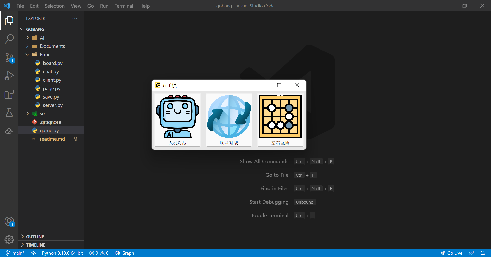
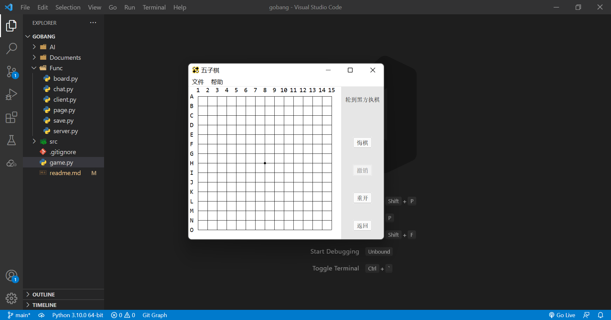
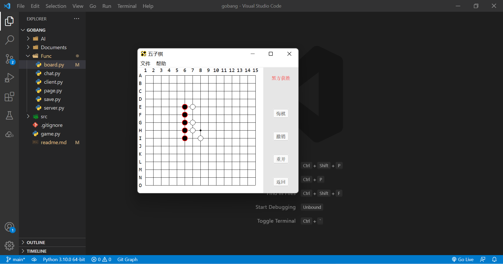
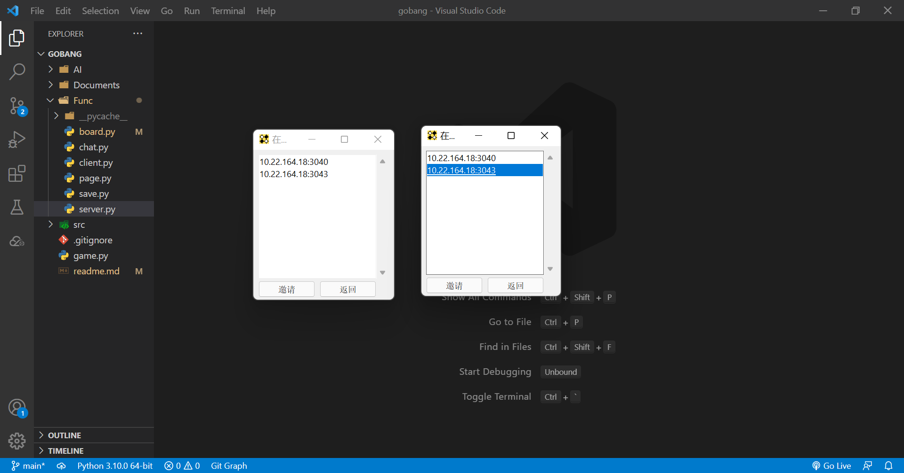
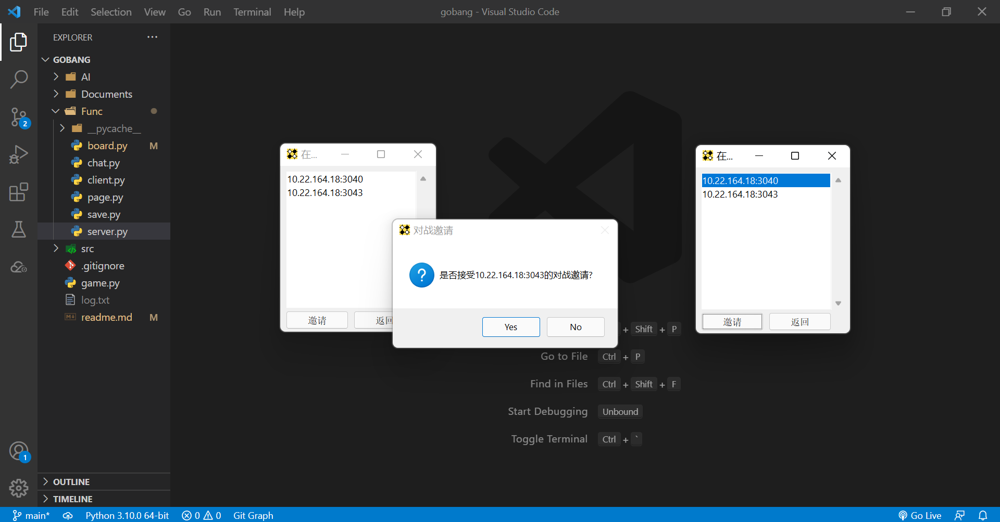
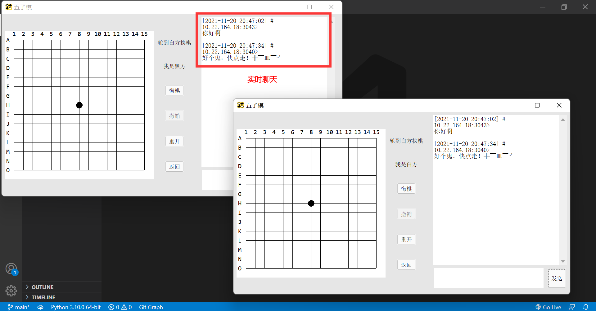
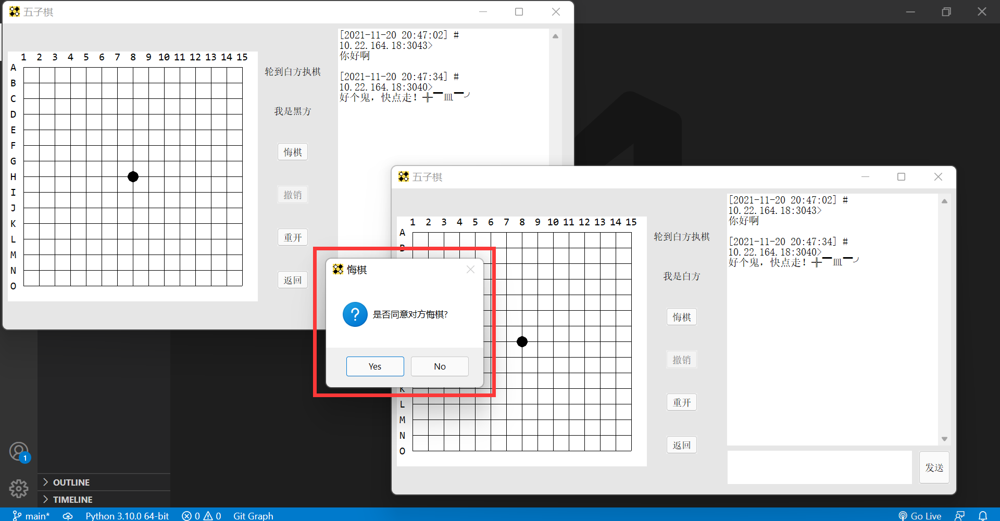
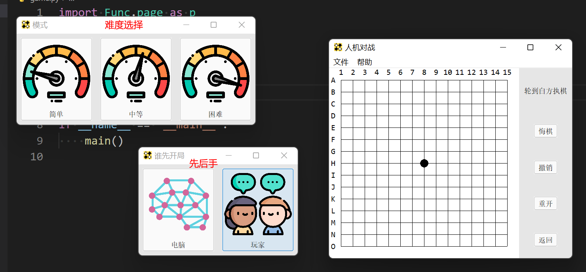

<div align="center"><h1>五子棋小游戏-tkinter版</h1></div>

> 作为软件概论大作业的仓库...

# 一、实现内容

- [x] 图形界面
- [x] 局域网联机
- [x] 人机对战
- [x] 悔棋
- [x] 先后手
- [x] 重新开始
- [x] 导出/导入棋盘

# 二、工作量

/(ㄒoㄒ)/~~ 左右互博和局域网联机做了我快一个星期, 一开始用的 pygame, 感觉按钮啊提示框啥的都要自己实现, 有点儿麻烦, 所以改用 tkinter了, 没想到这个也挺麻烦的, 网上的教程也很少

# 三、结果

1. 首页

   

2. 本地开局

   

3. 获胜界面

   

4. 网络联机

   > 需要先运行 server.py

   

   询问是否接受对战邀请

   

   可边下棋边聊天

   

   可拒绝/接受对方悔棋

   

5. 人机模式

   

# 五、总结

大作业害人不浅 (╯°□°）╯︵ ┻━┻

# 六、本地开发

```bash
pip install virtualenv
```

```bash
virtualenv venv
```

```bash
pip install -r requirements.txt
```

# 附录

1. [引言](Documents/Game-Tree.md)
2. [评分函数](Documents/evaluate.md)
3. [极大极小值搜索](Documents/MiniMax.md)
4. [alpha-beta剪枝](Documents/Alpha-Beta.md)
5. [Zobrist散列](Documents/Zobrist.md)
6. [启发式搜索](Documents/Heuristic.md)
7. [迭代加深](Documents/deeping.md)

# 参考资料

1. [lihongxun945/gobang](https://github.com/lihongxun945/gobang.git)
2. [colingogogo/gobang_AI](https://github.com/colingogogo/gobang_AI.git)
2. [如何设计一个还可以的五子棋AI](https://kimlongli.github.io/2016/12/14/如何设计一个还可以的五子棋AI/)

> 除了 AI 有参考资料，其他的都太零碎了，面向百度编程，也没什么好引用的...